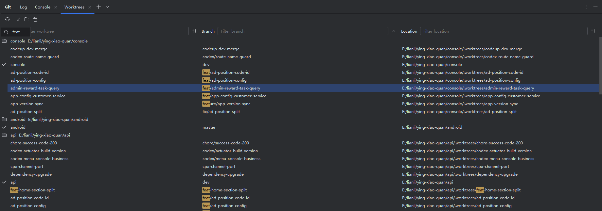
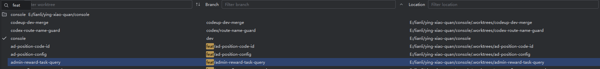
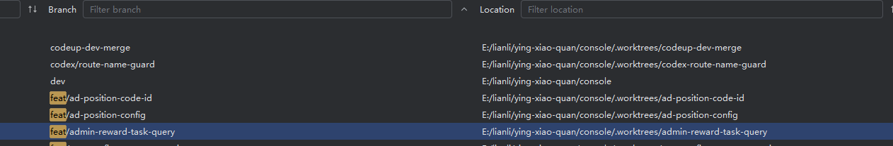
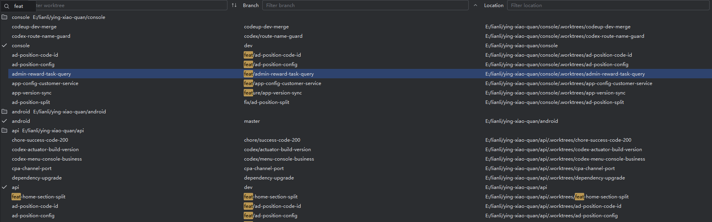
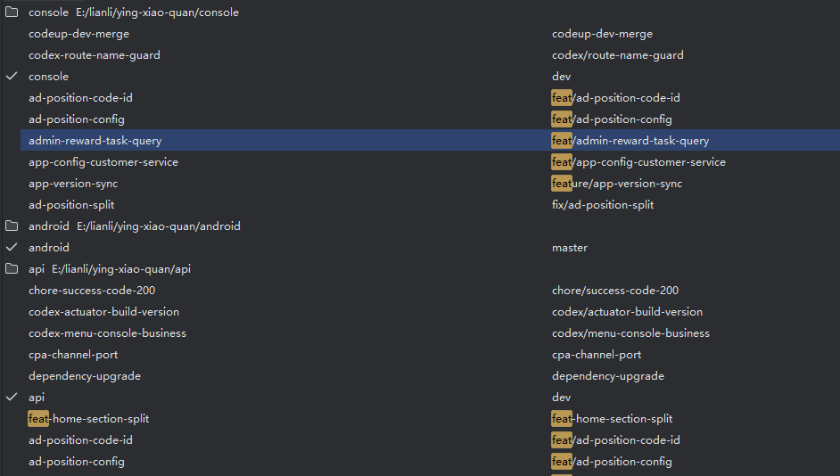

# Git Worktrees | GW4I Marketing Copy

This file keeps the English and Chinese copy together so the same material can be reused for README, JetBrains Marketplace, release notes, and external posts.

## English Marketing Copy

### Overview

Git Worktrees | GW4I brings linked worktree management into the Git tool window. It gives teams a single table for checking which worktrees exist, which branch each one uses, and where each checkout lives on disk.

### UI Navigation

Open the Worktrees tab from the Git main menu or the Git tool window drop-down. The plugin creates or selects a closable `Worktrees` tab inside the Version Control / Git tool window, while the standalone `Git Worktrees` tool window remains available as a fallback.

The Git menu entry includes a subtle `By GW4I` secondary marker, and the panel toolbar shows a compact provider note, so users can recognize which menu item and tab come from the plugin without extra visual noise.

### Filtering, Sorting, and Search

Header filters let users narrow the table by Worktree, Branch, or Location. Filtering is case-insensitive, and repository groups with no matching worktrees are hidden so the visible list stays focused.

Each column has a sort button that cycles through ascending, descending, and unsorted states. Multiple active sort buttons are applied in order within each repository group, keeping multi-root projects organized.

IntelliJ table Speed Search works on worktree rows and highlights matched fragments in place. Users can type a branch prefix, worktree name, or path fragment and jump directly to the relevant row.

### Worktree Operations

The toolbar and context menu expose the daily actions: Refresh, Checkout, Open, and Delete Worktree. Double-clicking a worktree also opens it as a project.

Checkout uses `--ignore-other-worktrees` when switching to a branch used by another linked checkout. If local changes or untracked files would be overwritten, the plugin asks before force checkout. When Checkout is unavailable, such as on detached HEAD or the current worktree, the disabled action keeps a clear reason in the menu tooltip.

Delete Worktree supports both single-row and multi-row deletion. Users can keep the branch, or delete the worktree and branch together. Main worktrees are protected from delete actions.

Checkout and delete commands run in background tasks, then reload the Worktrees panel and report success or failure through IDE notifications.

### Branch Menu Integration

Git Worktrees keeps normal branch workflows worktree-aware. In the IDE Git Branch menu, the plugin replaces the native checkout/delete behavior only when the selected branch is already used by another linked worktree. Ordinary branches continue to use the IDE's original actions.

The same protection is available from Git Log branch-label menus. When a commit is decorated with a local branch that belongs to another worktree, Checkout and Delete Branch actions are routed through Git Worktrees, including branch names that contain `/`. The plugin resolves those cases from Git metadata and action data, avoiding slow full worktree scans while menus are opening.

### Multi-root Projects

Repository rows group worktrees from every Git root in the project. This keeps monorepos and multi-module projects readable, whether the roots are named `console`, `api`, `android`, or something project-specific.

Repository groups can be collapsed or expanded with the left chevron, by double-clicking the repository row, or from the context menu. The collapsed state stays in the current panel while data reloads.

### Safety and Performance

Git operations refresh affected repositories and report success or failure through IDE notifications. Bulk deletion batches Git commands first, refreshes each repository once, and performs leftover directory cleanup as best-effort pooled work to avoid long visible delete tasks on Windows.

Single worktree deletion uses the same responsive cleanup path when Git has already unregistered a worktree but Windows reports a non-empty directory. Branch deletion runs before deferred physical cleanup, so the visible task finishes with the Git state already updated.

### Short Marketplace Summary

Manage linked Git worktrees directly from IntelliJ IDEA: browse all roots, filter and sort worktrees, use Speed Search highlighting, collapse repository groups, open or checkout branches, handle Git Branch and Git Log branch conflicts, and safely delete worktrees with optional branch cleanup.

## 中文宣传文案

本文件把英文和中文文案放在一起，方便同时复用于 README、JetBrains Marketplace、发布说明和外部宣传内容。

### 概览

Git Worktrees | GW4I 把 linked worktree 管理放进 Git 工具窗口。团队可以在一张表里看到当前有哪些 worktree、每个 worktree 对应哪个分支，以及它们分别位于哪个磁盘路径。

### 界面入口

可以从 Git 主菜单或 Git 工具窗口下拉菜单打开 Worktrees 标签页。插件会在 Version Control / Git 工具窗口中创建或选中一个可关闭的 `Worktrees` 标签页，同时保留独立 `Git Worktrees` 工具窗口作为回退入口。

Git 菜单入口会显示轻量的 `By GW4I` 二级标识，面板工具栏也会显示紧凑的来源说明，让用户能识别这个入口和标签页来自插件，同时不干扰日常使用。

### 过滤、排序和搜索

表头过滤可以按 Worktree、Branch 或 Location 收窄列表。过滤不区分大小写；如果某个仓库分组下没有匹配项，该分组会被隐藏，让可见列表保持聚焦。

每列都有排序按钮，可在升序、降序和未排序之间切换。多个已启用的排序按钮会按顺序在各自仓库分组内生效，让多 root 项目保持清晰结构。

IntelliJ 表格 Speed Search 会作用于 worktree 行，并在原位置高亮命中的文字片段。用户可以输入分支前缀、worktree 名称或路径片段，直接跳到相关行。

### Worktree 操作

工具栏和右键菜单提供日常操作：Refresh、Checkout、Open 和 Delete Worktree。双击 worktree 也可以把它作为项目打开。

当切换到已被另一个 linked checkout 使用的分支时，Checkout 会使用 `--ignore-other-worktrees`。如果本地变更或未跟踪文件可能被覆盖，插件会先弹窗确认再执行 force checkout。当 Checkout 不可用时，例如选中 detached HEAD 或当前 worktree，禁用菜单项会保留清晰的原因提示。

Delete Worktree 支持单行删除和多选批量删除。用户可以只删除 worktree，也可以同时删除 worktree 和对应分支。主 worktree 会受到保护，不会被删除操作命中。

Checkout 和 Delete 命令会在后台任务中执行，完成后重新加载 Worktrees 面板，并通过 IDE 通知提示成功或失败。

### 分支菜单集成

Git Worktrees 会让常用分支流程感知 worktree。在 IDE 的 Git Branch 菜单中，插件只会在选中分支已经被另一个 linked worktree 使用时替换原生 checkout/delete 行为；普通分支仍继续使用 IDE 原有动作。

同样的保护也适用于 Git Log 的分支标签菜单。当某个提交上的本地分支属于另一个 worktree 时，Checkout 和 Delete Branch 会交给 Git Worktrees 处理，包括带 `/` 的分支名。插件会通过 Git metadata 和 action data 解析这些情况，避免菜单打开时做完整 worktree 扫描。

### 多 root 项目

仓库分组行会把项目中每个 Git root 的 worktree 分开展示。无论 root 名为 `console`、`api`、`android`，还是项目自己的目录名，多仓库和多模块项目都能保持可读。

仓库分组可以通过左侧箭头、双击仓库行或右键菜单折叠和展开。折叠状态会在当前面板的数据重新加载后继续保留。

### 安全与性能

Git 操作完成后会刷新受影响仓库，并通过 IDE 通知反馈成功或失败。批量删除会先集中执行 Git 命令，每个仓库只刷新一次，并把残留目录清理放到后台尽力执行，避免 Windows 下可见删除任务时间过长。

单个 worktree 删除也使用同样的响应式清理路径：当 Git 已经 unregister worktree 但 Windows 仍报告目录非空时，先完成分支删除和仓库刷新，再把物理目录清理放到后台。

### Marketplace 短简介

在 IntelliJ IDEA 中直接管理 linked Git worktree：浏览所有 Git root，过滤和排序 worktree，使用 Speed Search 高亮，折叠仓库分组，打开或切换分支，处理 Git Branch 与 Git Log 分支冲突，并安全删除 worktree，可选择同步清理分支。
